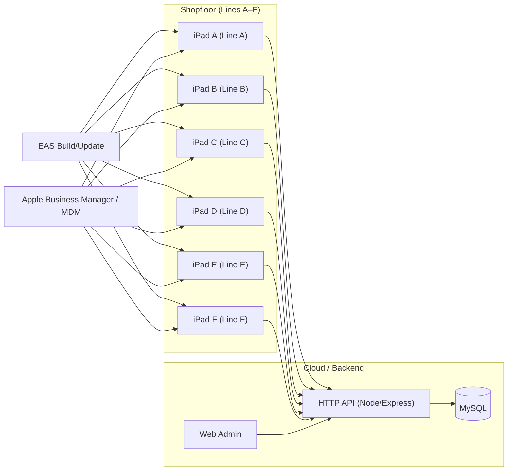

# FRUX工場管理アプリケーション<br><sub>FRUX Factory Manangement application</sub>

生産ライン上の重箱をリアルタイムで検出し、計数するトラッキングシステム。
<br>A tracking system provides real-time counting of Osechi box moving on production line.

[](https://www.python.org/)
[](https://colab.research.google.com/)


[](https://opensource.org/licenses/MIT)


## 概要<br><sub>Overview<sub>

本プロジェクトは、既存の『おせち箱トラッキングアプリ』に自動計数システムを統合・アップデートすることを目的としています。コンピュータビジョン技術をモバイルプラットフォームへ連携させることで、生産ラインの監視と在庫管理をリアルタイムかつシームレスに実現します。
<br>**おせち箱管理モバイルアプリの詳細については、以下のリポジトリをご覧ください。[Osechi-Production-Management-App](https://github.com/byutan/Osechi-Production-Management-App)**
<br>This is a continuous development aims to update and intergrate counting system into current Osechi production management app.
<br>**For detail about Osechi mobile app, please visit [Osechi-Production-Management-App](https://github.com/duchuy1805/Osechi-Production-Management-App)**

## アプリアーキテクチャ<br><sub>Application Architecture<sub>


# クイックスタート - Quick Start

### 前提条件 - Prerequisites

2. **Pythonのバージョン確認 - Verify Python version**
```bash
python -v 
```
```3.11.9```を確認してください。
<br>Make sure the version is ```3.11.9```.

3. **Microsoft Visual C++ Redistributableを確認する - Verify Microsoft Visual C++ Redistributable**
```bash
Get-ItemProperty HKLM:\SOFTWARE\Microsoft\Windows\CurrentVersion\Uninstall\* | Select-Object DisplayName | Where-Object { $_.DisplayName -like "*Visual C++*" }
```
まだインストールしない場合、以下のリリンクをご覧ください[Microsoft.com](https://learn.microsoft.com/en-us/cpp/windows/latest-supported-vc-redist?view=msvc-170#latest-supported-redistributable-version)
<br>If not yet installed, please visit [Microsoft.com](https://learn.microsoft.com/en-us/cpp/windows/latest-supported-vc-redist?view=msvc-170#latest-supported-redistributable-version)

Visual C++ v14ランタイムのセクションから、「X64」用実行ファイル（exe）を選択してください。
<br>Select **X64** exe file from **Visual C++ v14 Redistributable** section.

4. Python仮想環境 - Python virtual environment
```bash
python -m venv venv
```

5. カウンターの依存ライブラリをインストールする- Install counter dependencies
```bash
python -m pip install -r counter\requirements.txt 
```


6. 仮想環境を有効化する - Activate the virtual environment
```bash
(Set-ExecutionPolicy -Scope Process -ExecutionPolicy RemoteSigned) ; (& c:\Users\fruxt\Osechi-Production-Management-App\.venv\Scripts\Activate.ps1)
```

7. PSSecurityException」により「UnauthorizedAccess」エラーが発生した場合は、以下のコマンドを実行してください：
<br>If you get **UnauthorzedAccess** from **PSSecurityException**, use the command below:
```bash
Set-ExecutionPolicy -ExecutionPolicy RemoteSigned -Scope CurrentUser 
```

8. NodeJSをインストールする- Install NodeJS 
 ```bash
 npm install
 ```

 9. 「[ivcam](https://www.e2esoft.com/ivcam/)」と「[vscode](https://code.visualstudio.com/download?_exp_download=fb315fc982)」と「[mysql](https://www.mysql.com/downloads/)」をインストールする - Install ivcam, vscode, mysql

## アプリをスタート<br><sub>Start the application<sub>

1. フォルダーパスの確認 - Verify folder path
```bash
..:\...\...\Osechi-Production-Management-App
```

2. ターミナルを3つ開く - Turn on 3 terminals 
- 一番目のターミナル - First terminal
```bash
npx expo start --clean
```
- 二番目のターミナル - Second terminal
```bash
cd backend 
node server.js
```
- 三番目のターミナル - Third terminal
[yolov8m](https://drive.google.com/file/d/1F90aeZWMCpvbYEHfqGl7tqWpWkg3XkSr/view?usp=sharing) または [yolov11m](https://drive.usercontent.google.com/download?id=1IM1E4bVMjMOdajFGENb0LDR2_BFNhHxl&export=download&authuser=0) の best.pt ファイルをいずれか選択してください。
<br>Choose either [yolov8m](https://drive.google.com/file/d/1F90aeZWMCpvbYEHfqGl7tqWpWkg3XkSr/view?usp=sharing) or [yolov11m](https://drive.usercontent.google.com/download?id=1IM1E4bVMjMOdajFGENb0LDR2_BFNhHxl&export=download&authuser=0) **best.pt** file.
```bash
cd counter
yolo export model=best.pt format=openvino; python count.py #This creates a "best_openvino_model" folder inside "counter", skip this if already exists.
py count.py
```

3. [ivcam]というアプリがあるiPadを7台準備してください - Prepare 7 ipads with ivcam apps (You can adjust it inside **backend/counter/count.py**).
4. iPadを1台使い、最初のターミナルに表示されたQRコードをスキャンしてください - Use 1 ipad and scan QR code from **first terminal**.
5. **同じネットワーク**に接続してください - Make sure to connect to the **same network**.