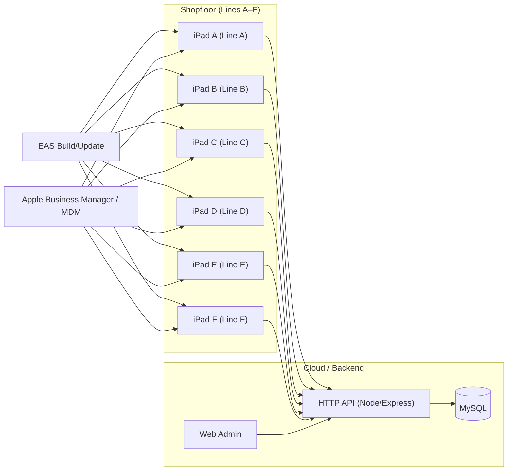

# FRUX Factory Manangement application

This is an [Expo](https://expo.dev) project created with [`create-expo-app`](https://www.npmjs.com/package/create-expo-app).

## Application Architecture



## Get started

1. Install dependencies

   ```bash
   npm install
   ```

2. Start the app

   ```bash
   npx expo start
   ```

In the output, you'll find options to open the app in a

- [development build](https://docs.expo.dev/develop/development-builds/introduction/)
- [Android emulator](https://docs.expo.dev/workflow/android-studio-emulator/)
- [iOS simulator](https://docs.expo.dev/workflow/ios-simulator/)
- [Expo Go](https://expo.dev/go), a limited sandbox for trying out app development with Expo

You can start developing by editing the files inside the **app** directory. This project uses [file-based routing](https://docs.expo.dev/router/introduction).

## Get a fresh project

When you're ready, run:

```bash
npm run reset-project
```

This command will move the starter code to the **app-example** directory and create a blank **app** directory where you can start developing.

## Learn more

To learn more about developing your project with Expo, look at the following resources:

- [Expo documentation](https://docs.expo.dev/): Learn fundamentals, or go into advanced topics with our [guides](https://docs.expo.dev/guides).
- [Learn Expo tutorial](https://docs.expo.dev/tutorial/introduction/): Follow a step-by-step tutorial where you'll create a project that runs on Android, iOS, and the web.

## Join the community

Join our community of developers creating universal apps.

- [Expo on GitHub](https://github.com/expo/expo): View our open source platform and contribute.
- [Discord community](https://chat.expo.dev): Chat with Expo users and ask questions.
# おせち箱・発見すること・数えること・システム<br><sub>Osechi-tracking-counting-system</sub>

生産ライン上の重箱をリアルタイムで検出し、計数するトラッキングシステム。
<br>A tracking system provides real-time counting of Osechi box moving on production line.

[](https://www.python.org/)
[](https://colab.research.google.com/)
[](https://opensource.org/licenses/MIT)


## 概要<br><sub>Overview<sub>

本プロジェクトは、既存の『おせち箱トラッキングアプリ』に自動計数システムを統合・アップデートすることを目的としています。コンピュータビジョン技術をモバイルプラットフォームへ連携させることで、生産ラインの監視と在庫管理をリアルタイムかつシームレスに実現します。
<br>**おせち箱管理モバイルアプリの詳細については、以下のリポジトリをご覧ください。[Osechi-Production-Management-App](https://github.com/byutan/Osechi-Production-Management-App)**
<br>This is a continuous development aims to update and intergrate counting system into current Osechi production management app.
<br>**For detail about Osechi mobile app, please visit [Osechi-Production-Management-App](https://github.com/duchuy1805/Osechi-Production-Management-App)**

## フォルダストラクチャ<br><sub>Folder Structure<sub>
```
.
├── .gitignore              # gitignoreファイル
├── NotoSansJP-Regular.ttf  # 日本語フォント
├── README.md               # プロジェクト資料·
├── bytetrack.yaml          # 設定ファイル
└── osechi_tracking.py      # トラッキングファイル
```

## クイックスタート - Quick Start

### 前提条件 - Prerequisites

1. **Pythonのバージョン確認 - Verify Python version**
```bash
python -v 
```
```3.11.9```を確認してください。
<br>Make sure the version is ```3.11.9```.

2. **Microsoft Visual C++ Redistributableを確認する - Verify Microsoft Visual C++ Redistributable**
```bash
Get-ItemProperty HKLM:\SOFTWARE\Microsoft\Windows\CurrentVersion\Uninstall\* | Select-Object DisplayName | Where-Object { $_.DisplayName -like "*Visual C++*" }
```
まだインストールしない場合、以下のリリンクをご覧ください[Microsoft.com](https://learn.microsoft.com/en-us/cpp/windows/latest-supported-vc-redist?view=msvc-170#latest-supported-redistributable-version)
<br>If not yet installed, please visit [Microsoft.com](https://learn.microsoft.com/en-us/cpp/windows/latest-supported-vc-redist?view=msvc-170#latest-supported-redistributable-version)

Visual C++ v14ランタイムのセクションから、「X64」用実行ファイル（exe）を選択してください。
<br>Select **X64** exe file from **Visual C++ v14 Redistributable** section.

### セットアップ - Setup

1. Python仮想環境 - Python virtual environment
```bash
python -m venv venv
```

PSSecurityException」により「UnauthorizedAccess」エラーが発生した場合は、以下のコマンドを実行してください：
<br>If you get **UnauthorzedAccess** from **PSSecurityException**, use the command below:
```bash
Set-ExecutionPolicy -ExecutionPolicy RemoteSigned -Scope CurrentUser 
```

スタート
<br>Activate the virtual environment
```bash
.\venv\Scripts\activate
```

2. 依存関係のインストール - Installing dependencies
CPU Pytorch
```bash
pip install torch torchvision torchaudio --index-url https://download.pytorch.org/whl/cpu
```

Ultralytics
```bash
pip install ultralytics
```

OpenVINO
```bash
pip install openvino
```

Piplow
```bash
pip install Pillow
```

Lapx
```bash
pip install lapx
```

3. 実行 - Executing
- トラッキング用の動画（例: video.mp4）を入力する場合は、保存先のパスに変更してください。
<br>If you want to input a video for tracking (for example **video.mp4**), change the path to your destination
```bash
self.video_path = os.path.join(dir, 'video.mp4') 
cap = cv2.VideoCapture(self.video_path)
```

- best.ptをOpenVINOモデルにエクスポートします。
<br>Export best.pt to openvino model
```bash
yolo export model=best.pt format=openvino
```

- システムを実行します。
<br>Execute the system
```bash
python osechi_tracking.py
```

- カウントを終了するには、**q**キーを押してください。ルートフォルダに**tracking_data**フォルダが作成されます。
<br>To end counting, press **q** and a folder **tracking_data** will appear in the root folder.
